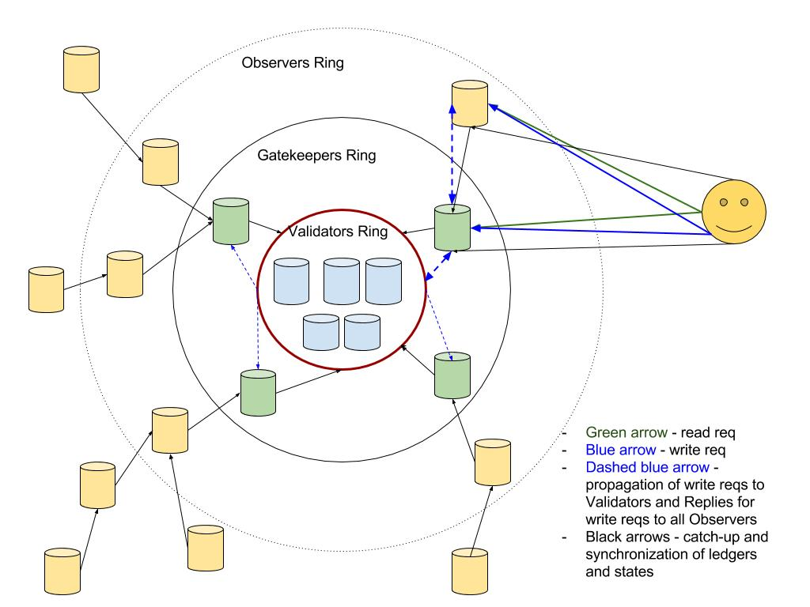

As of now we have Validator Nodes only responsible for write and read requests as well as catching up other Nodes and clients.
With a state proof support, we can create additional rings of Observer Nodes that can process read requests and reduce load on Validator nodes.

## Goals (in priority order)

- Goal1: Reduce Read Load
    - Reduce read load on Validators

- Goal2: More Nodes
    - Have a big number of Nodes available for read requests (we have an essential limit on the size of Validator Nodes because of how chatty RBFT is)
    
- Goal3: Reduce Catch-up Load
    - Reduce catch-up load on Validators
    
- Goal4: Reduce Write Load
    - Be able to send write requests to one Node only (either Validator or Observer)
    
- Goal5: Promotion
    - Be able to replace suspicious Validators to Gatekeepers (promote Gatekeepers)
    
- Goal6: Untrusted Observers
    - Be able to have unlimited number of Nodes with a copy of the ledger
    
- Goal7: Fast Catch-up of clients
    - Be able to bootstrap catch-up for clients using one Node (either Validator or Observer)
    
- Goal8: Fast Catch-up of Nodes 
    - Be able to bootstrap catch-up for Nodes using one Node (either Validator or Observer)
    
- Goal9: Close the gates
    - Forbid all external client communication for Validators (allow only restricted communication with Gatekeepers and other Validators), so that
        - Gatekeepers ring serves as one of the stoppers for DoS/Spam attacks.
        - Helps to avoid attacks on Primary
        - Helps to reduce the number of connections for Validators
        - Helps to improve availability of Validators
        
- Goal10: Stand DoS from clients
    - The core ring(s) need to be able to stand DoS from clients.
    Some observers may fail, but the system in general should be working, especially Validator rings. 
    
- Goal11: Stand DoS from nodes        
    - The Validator ring needs to be able to stand DoS from other Validator Nodes and Gatekeeper rings.

## Architecture

###Assumptions
- We call Trusted Observers “Gatekeepers” because they eventually will become them when we “close the gate” to Validators.
If we don’t want that to ever happen, then we probably should find a better name for Gatekeepers to avoid confusion (just call them Observers?)

- Gatekeepers are added in permissioned fashion (there is a Steward for each Gatekeeper)

- Gatekeepers are in sync with Validators
    - It means that clients (indy-sdk) do not need to have neither a separate pool ledger for each Gatekeeper nor a Pool State trie (Patricia trie).
- Observers may not be fully in sync with Validators and Gatekeepers at a given moment of time (depends on the synchronization policy), although shoud be in sync eventually.
 There will probably be a gap between the latest Validators state and latest Observer state.
    - It means that clients (indy-sdk) need to have either a separate pool ledger for each Observer, or a Pool State trie (Patricia trie)
- There is enough Gatekeeper Nodes to create a separate Ring

###Iterations
It’s better to implement the long-term solution in multiple iterations (taken into account the Priority of Goals above):
1. Support Gatekeepers only (that is trusted Observers which are always in sync)
1. Support Observers (untrusted Observers which may not be 100% in sync)
1. “Close the gate” to Validators to allow Validators be connected to Gatekeepers only

Note: We may change the order of Iterations (and hence the roadmap of tasks in the last section) depending on the requirements and priority of Goals

###Data to keep in sync on Gatekeepers and Observers
- All ledgers
- All states
- Attributes store
- BLS store (in fact the last entry only) 
- seqNo store

###Participants

##### Catch-up
|  | What ledger | Min Number of nodes to finish | Node type to finish | Bootstrapping 
| --- | --- | --- | --- | --- 
Client | POOL | F_G + 1 (or even 1 if use state proofs and timestamp)| Gatekeepers | Yes (from Observers and Gatekeepers)
Observer | All | F_G + 1 (or even 1 if use state proofs and timestamp)| Gatekeepers | Yes (from Observers and Gatekeepers)
Gatekeeper | All | F_V + 1 (or even 1 if use state proofs and timestamp)| Validators | Yes (from Gatekeepers and Validators)
Validator | All | F_V + 1 (or even 1 if use state proofs and timestamp)| Validators | Yes (from Gatekeepers and Validators)

##### Read and Write
| | Read Node type | Read Min Number of nodes | Write Node type | Write Min Number of nodes | 
| --- | --- | --- | --- | ---  |
Client | 1 | Observer OR Gatekeeper | 1 (eventually propagated to f_V+1 validators by Observers and Gatekeepers) | Observer OR Gatekeeper

##### Keep in sync

| | How | Node type to connect to for sync
| --- | --- | ---
Client | No (do catch-up for syncing); TBD in future |  
Observer | Catch-up + Any custom policy | Other Observers and Gatekeepers
Gatekeeper | Catch-up + Receive all write Replies | Validators
Validator | Catch-up | Validators 

#### Description
- Validators Ring: 
    - Has its own Steward, and added to the Pool by a NODE txn with VALIDATOR service
    - Participates in consensus (write requests ordering)
    - Do not process any Clients nor Observers requests
    - Supports restricted connections to other Validators and Gatekeepers only (not to Observers)
    - Provides catch-up for Gatekeepers and other Validators only (neither for Clients nor other Observers)
    - Connected to all Gatekeepers (the same way as to Validators, but just doesn’t include them into 3PC)
    - Propagates all write replies to all Gatekeepers to make them in sync
    - Can bootstrap catch-up using other Gatekeepers or Validators and validate catch-up results using state proofs and timestamp of the latest state.
    - Has BFT f parameter as f_V
    - The number of Validators can not be too big because of RBFT chattiness problem
- Gatekeepers Ring: 
    - Has its own Steward, and added to the Pool by a NODE txn with GATEKEEPER service
    - Handles read requests by its own using State Proofs
    - Can handle write requests by propagating them to Validators and using Write State Proof 
    - Registers to Validators to be in sync with them on every Reply
    - Can become a Validator
    - Can register Observers to keep them in sync
    - Can bootstrap catch-up using other Gatekeepers or Validators and validate catch-up results using state proofs and timestamp of the latest state.
    - Has BFT f parameter as f_G
    - The number of Gatekeepers can be bigger than the number of Validators since it doesn’t have RBFT chattiness problem
- Observers Ring
    - May be added with a NODE txn with OBSERVER service, or not added to the pool ledger at all (some internal sync-up point)
    - Handles read requests by its own using State Proofs
    - Can handle write requests by propagating them to Gatekeepers and using Write State Proof 
    - Registers to Gatekeepers with some synchronization policy to be in sync
    - Can not become a Validator
    - Can register Observers to keep them in sync => a net of Observers
    - Can bootstrap catch-up using other Observers or Gatekeeper’s states and validate catch-up results using state proofs and timestamp of the latest state.
    - No restrictions on a number of Observers 
- Clients
    - Can connect to Observers or Gatekeepers only
    - It’s sufficient to connect to one Observer or Gatekeeper only to send read and write Requests because of State Proofs
    - Can bootstrap catch-up using Gatekeeper or Observer states
    - Need to finish catch-up (check merkle tree root) using Gatekeepers Rings

##Roadmap

Note: the roadmap is provided according to the priority of goals above. If priority needs to be changed (for example, we would like to start with Untrusted/unsynced Observers), then the set of tasks will be the same, just the order will change.

###Indy-Node
- Goals 1-3: \
Reduce Read Load, \
More Nodes,\
Reduce Catch-up load
    1. Support GATEKEEPER service in NODE txn, define auth rule on who can create gatekeepers Nodes. No special behaviour for Gatekeepers yet
    1. Separate pool to Validators and gatekeepers with N_V, f_V and N_G, f_G and make them connect to each other
    1. Support adding abstract Observers to Nodes and possibility of a custom policy for syncing (no real policies yet)
    1. Register all Gatekeeper Nodes as Observers with a default Policy to send each write Reply to all Gatekeepers
    1. Restrict Gatekeepers to process read requests only and exclude them from consensus. Gatekeepers reject write requests at this point
    1. Support processing observed data by Gatekeepers (or Observers in general)
    1. Catch-up BLS store by all Nodes (in fact the latest BLS store is needed)
    1. Catch-up seqNo store by all Nodes
- Goal4: Reduce Write load
    1. Make sure that a valid Reply with Audit Proof is sent for already processed reqId  
    1. Support receiving of Write Requests by Gatekeepers and propagate them to Validators with processing Replies back 
- Goal5: Promotion
    1. Define auth rules on who can change Node’s service (promotion to Validators) 
    1. Re-calculate N_V and f_V parameters when Gatekeeper Node is promoted to Validator 
- Goal6: Untrusted Observers
    1. Support OBSERVER service in NODE txn, define auth rule on who can create Observer Nodes. Make Observers and Gatekeepers equal for now.
    1. Be able to register any Observers with a custom policy
        - Define some policies for observing and implement syncing the state of Observers (so, the only difference between Observer and Gatekeeper here is that Observers can use any custom policy)
    1. Support periodic updates of BLS sigs
- Goal7: Fast Catch-up of clients
    1. Support BLS multi-signature for Pool and Config ledgers (that is for all ledgers) 
    1. Create a new genesis txn file where each genesis pool txns has BLS key
    1. Keep the history of BLS multisig for Pool Ledger
    1. Return BLS multi-sig during catch-up of each txn in Pool Ledger, so that it’s possible to catch-up from one Node only and verify result using previous pool states
- Goal8: Fast Catch-up of Nodes
    1. Support verification of Pool ledger based on BLS multi-sg history for each txn
    1. Support bootstrapping of catch-up of Validators and Gatekeepers from other Validators and gatekeepers
        - take ledger from one Node and use BLS multi-sig for validation
        - Catch-up needs to finished by checking that the received from one node state matches the state on at least f_V+1 other Nodes (check merkle tree roots)
    1. Support bootstrapping of catch-up of Observers from other Observers and gatekeepers 
    1. [Optionally] Support bittorent-like catch-up bootstrapping
    1. [Optionally] We may probably need to support Rocksdb for better propagation of parts of ledger and recovery
- Goal9: Close the gate
    1. Do not allow any Observers or clients connections by Validators
    1. Connect Observers to Gatekeepers only
    1. Propagate write requests on Observers to Gatekeepers

- Goal10: Stand DoS from clients
    1. Load balancing for Observer nodes (Nginx?)
    1. Change client-to-node communication from ZMQ to something else (http+authcrypt?)
    
- Goal11: Stand DoS from nodes
    1. Blacklist malicious nodes
    1. Make communication and consensus levels separate in nodes
    

###Indy-sdk
- Goals 1,2,5: \
 Read Load, \
 More Nodes, \
 Promotion
    1. Support GATEKEEPER service in NODE txn on client side
    1. Separate pool to Validators and Gatekeepers with N_V, f_V and N_O, f_O
    1. Send read requests to Gatekeepers Nodes
        - Connect to one Gatekeeper Node only (explicitly or randomly) and work with this Node for read requests
        - If Read request to a Gatekeeper Node fails for some reasons (timeout, invalid state proof, etc.), then resend the request to another Gatekeeper Node
        - If there is no more Gatekeeper Nodes to send read request to, then send it to Validators 
        - Support fallback to f+1
        - Note: neither a separate pool ledger for each Gatekeeper nor pool state trie is needed on client here because we assume that Gatekeepers are always in sync with Validators
- Goal3: Reduce Catch-up load
    1. Support catch-up based on Gatekeepers (with a fallback to catch-up on Validators)
    1. [Optional] Validate catch-up correctness sending LEDGER_STATUS to Validators
    
- Goal4: Reduce Write Load
    1. Verify audit proof on write requests
    1. Send write requests to Gatekeepers Nodes
        - Can send both reads and writes to the same Gatekeeper Node with the same fallback rules
        - It’s essential that re-sending must be done with the same reqId

- Goal6: Untrusted Observer
    1. Support specifying any Observer Node for read and write (not necessary Gatekeeper). Fallback to Gatekeepers, and only then to Validators.
    1. Support a gap in Observer’s state
        - Option1: have a separate pool ledger for each Observer and do a catch-up for each Observer
        - Option2: Patricia trie for Pool state on clients

- Goals 7,8: Fast Catch-up of clients and Nodes
    1. Support bootstrapping of pool ledger from one Node only (either Observer, Gatekeeper or Validator)
    1. Validate bootstrapped ledger by provided BLS sigs.
    1. Finish catch-up by validating the correctness of ledger from f_G + 1 (or f_V+1) nodes.

- Goals 9: “Close the gate”
    1. Forbid any connections to Validators from sdk. 
